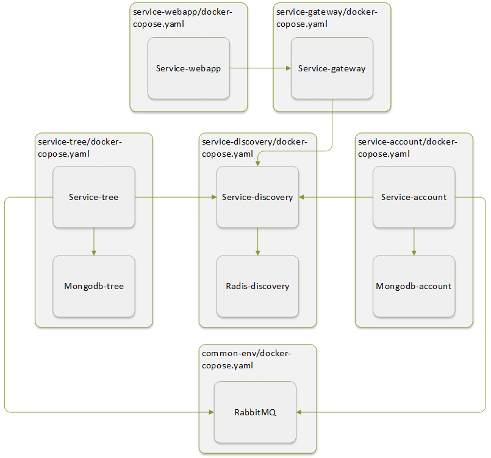

[logo]: logo.png

O`Family is a web service that helps to build the family tree. The project consits of backend and fronentd sides. The former is implemented based on microservice architecture and Go lang and the latter as SPA based on React (JavaScript).

# Architecture

## Components

#### Common libs
* [common-go](./common-go)
* [common-env](./common-env)

#### Infrastructure components
* [service-discovery](./service-discovery)
* [service-gateway](./service-gateway)

#### Business services
* [service-account](./service-account)
* [service-tree](./service-tree)
* [service-static](./service-static)
* [service-webapp](./service-webapp)

